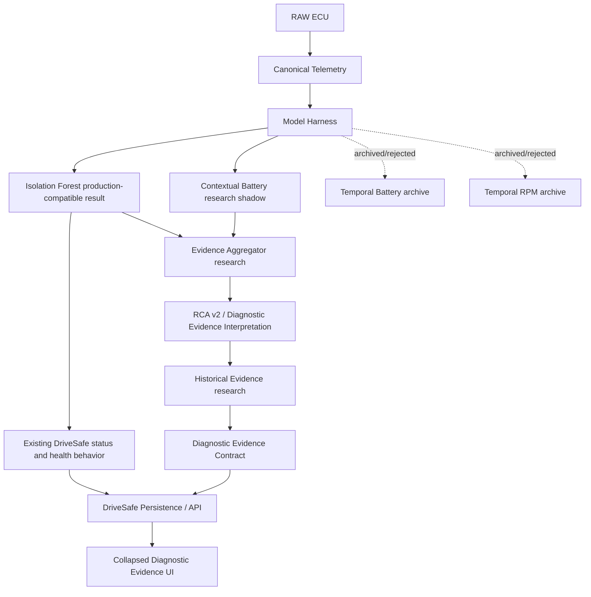

# RA1 Architecture Overview

RA1.1 reconciliation status: H9 analyzer to DriveSafe integration completed: `True`.

## Executive Summary

The analyzer currently solves a bounded problem: it turns canonical ECU telemetry into deterministic window features, runs a production-compatible Isolation Forest anomaly detector, and preserves additive research evidence about detector coverage, disagreement, evidence interpretation and history. The system does **not** currently prove root causes, vehicle health, component failure probability, or future failure risk.

The smallest justified architecture is:

1. Canonical telemetry and deterministic window features.
2. Model Harness with Isolation Forest as the production baseline.
3. Additive diagnostic evidence metadata that never changes public anomaly status.
4. Research extensions for Contextual Battery, evidence aggregation, RCA v2 and historical evidence, now presented in DriveSafe as collapsed research evidence.

The current research architecture should be frozen at two active detectors: `isolation_forest` and `contextual_battery_voltage`. Both temporal candidates are archived as negative experiments.

## Architecture Map

Production: Isolation Forest production-compatible result and existing DriveSafe status/health behavior.

Research evidence: Contextual Battery, evidence aggregation, RCA v2, historical evidence and the collapsed diagnostic evidence UI.

Archived experiments: Temporal Battery detector, Temporal RPM detector and H7 RCA v1 causal interpretation.

## Production Path

Production analysis uses `app/services/analysis_service.py` and `app/ml/inference.py`. The live harness is instantiated with only `IsolationForestDetector`, so existing predictions, anomaly events, health scores and DriveSafe-compatible response fields remain anchored to the Isolation Forest. H2 parity passed on the checked-in handoff snapshot using exact comparisons for discrete outputs and `atol=1e-09`, `rtol=1e-12` for floats. The historical Git checkout was unavailable because the workspace has no `.git`, so the pre-H1 reference is the checked-in Pi handoff source snapshot.

## Research Path

The research path keeps Core 2, Evidence Aggregation, RCA v2 and Historical Evidence offline/shadow. H3 established narrow feasibility for contextual battery-voltage detection using verified signals: rpm, tps_voltage, tps_raw, battery_voltage. H3.1 found 23 contextual events, 623 disagreement windows, and stable leave-one-reference-session-out behavior. H5 then aggregated two active detectors over 12859 windows without score fusion.

## Rejected Research Path

Temporal Battery and Temporal RPM remain implemented for reproducibility but are not active detectors. H4/H4.1 found the battery temporal candidate had one stable event but no unique event value. The RPM candidate had one Core3-only event, but low coverage and parameter sensitivity made promotion unjustified.

## Diagnostic Interpretation

RCA v2 is better understood architecturally as a deterministic Diagnostic Evidence Interpretation Engine. It retains the RCA name for compatibility, but H7.3 produced 95 observations, 8 symptoms, 0 possible causes and 109 recommended checks. This is preferable to preserving H7 v1's unsupported causal language.

## Historical Evidence

H8 uses structured prior observations rather than generic memory. It indexed 716 records across 38 sessions. It changed check priority in 22 cases and changed causal hypotheses in 0 cases.

## DriveSafe Integration Boundary

H9 makes the analyzer-side `diagnostic_evidence` payload additive and backward-compatible. H9B confirms DriveSafe Web App integration: repository available `True`, completed `True`. DriveSafe tolerantly ingests optional evidence, persists valid evidence in existing `AnalysisResult.result_summary` JSON, exposes raw evidence plus a display-only `diagnostic_evidence_view`, and renders the collapsed research-evidence section. Production anomaly/status/health semantics remain unchanged. Integration notes: DriveSafe consumes diagnostic_evidence as nullable JSON on existing analysis summaries.; diagnostic_evidence_view is display-only and is not used to derive production result, health, alerts or completion state.; DriveSafe does not recompute detector inference, aggregation, RCA v2 or historical recurrence/trend evidence.
