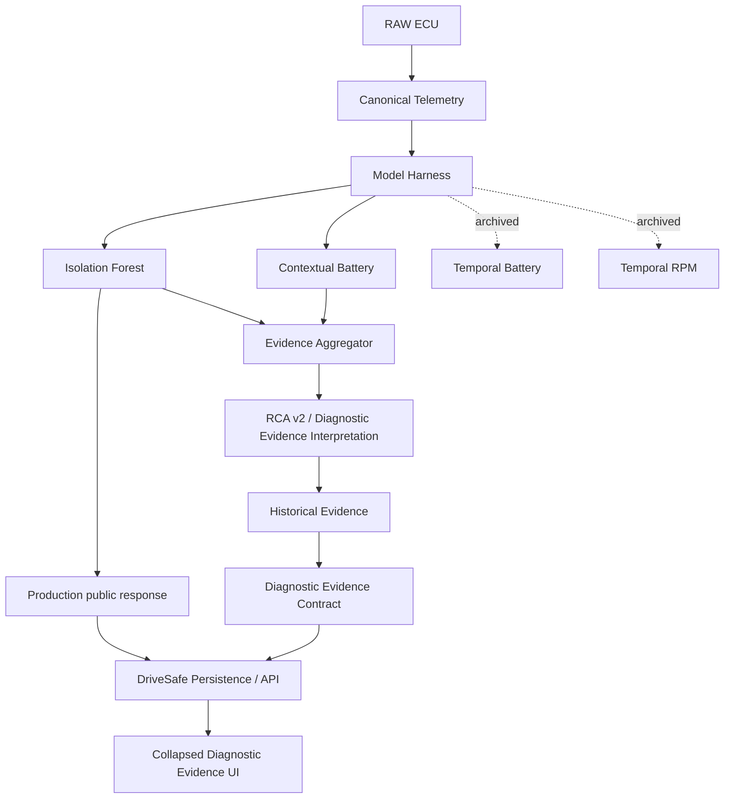

# RA1 Architectural Dependency Map

## True Dependencies

Canonical telemetry is required by every path. Window features are required by all current detectors. The Model Harness is required for detector execution and failure isolation. Isolation Forest is required for current production anomaly status. Contextual Battery is required only for the research evidence path.

Evidence Aggregation depends on detector outputs. Without active detector outputs it can still report insufficient coverage, but it has no positive/negative evidence relationship to interpret. RCA v2 depends on aggregated evidence; without aggregation it becomes a generic rules engine with no case evidence. Historical Evidence depends on structured observations and temporal cutoff metadata; without RCA v2/H5 artifacts it has no current case representation to compare.

## Removal Impact

If Contextual Battery were removed tomorrow, production anomaly behavior would not break. The research system would lose contextual voltage evidence, disagreement states involving Core 2, and the main reason to keep heterogeneous aggregation beyond a single-detector schema.

If Evidence Aggregation were removed, RCA v2 and H8 would lose their clean input contract. Production Isolation Forest predictions would still run.

If Historical Evidence were removed, current-session interpretation would still work, but recurrence, persistence, trend and check-priority context would disappear.

If `diagnostic_evidence` were omitted from an API response, old clients should still work; H9 marks it additive and nullable, and H9B verifies DriveSafe legacy behavior. DriveSafe owns ingestion, persistence, API presentation and UI. It does not duplicate detector inference, aggregation semantics, RCA rules or historical recurrence/trend computation.
